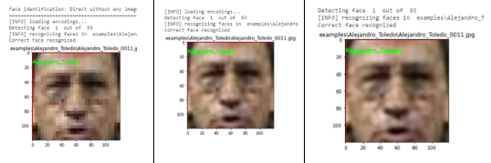
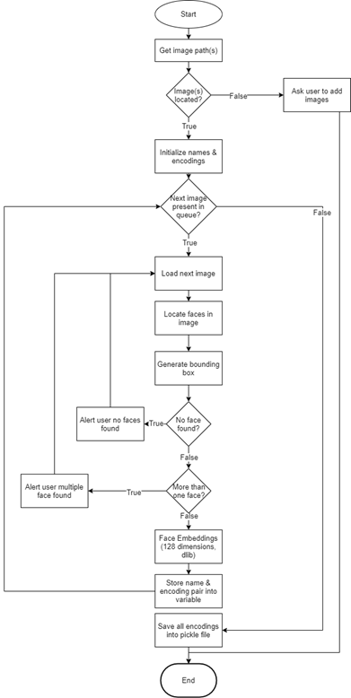

# Low-resolution Face Recognition & Identification using Super-Resolution

- This project is a face recognition & identification application designed to detect & identify faces from pictures that are of size 30x30 pixels.
- It is built on Jupyter Notebook, and super-resolution libraries (EDSR image super-resolution).
- Achieved accuracy of at least 90% on samples across 30 distinct faces. 
- All faces have been taken from the LFW3D face samples and real-life faces (redacted personal information)

## Technologies Used

- Programming Language: Python
- Technologies:
  - OpenCV
  - EDSR (Enhanced Deep Residual Networks) image super-resolution supplied internally by OpenCV
  - Bicubic & nearest-neighbor scaling (for comparison purpose)

## Installation

- Download the repository and unzip it
- Install Anaconda Python IDE
- Install relevant libraries
- Select the version to run (for KNN model, use the `knn-version`; for SVM model, use the `svm-version`)
- Open the relevant `.ipynb` notebook in the folder in sequence

## Project Details

### System Flowchart

#### Step 1: Build face encodings (dataset training)

#### Step 2: Perform face identification

## Credits

- LFW3D for the faces supplied
- Mr. Geitgey for his high-resolution face recognition & identification trained model.

